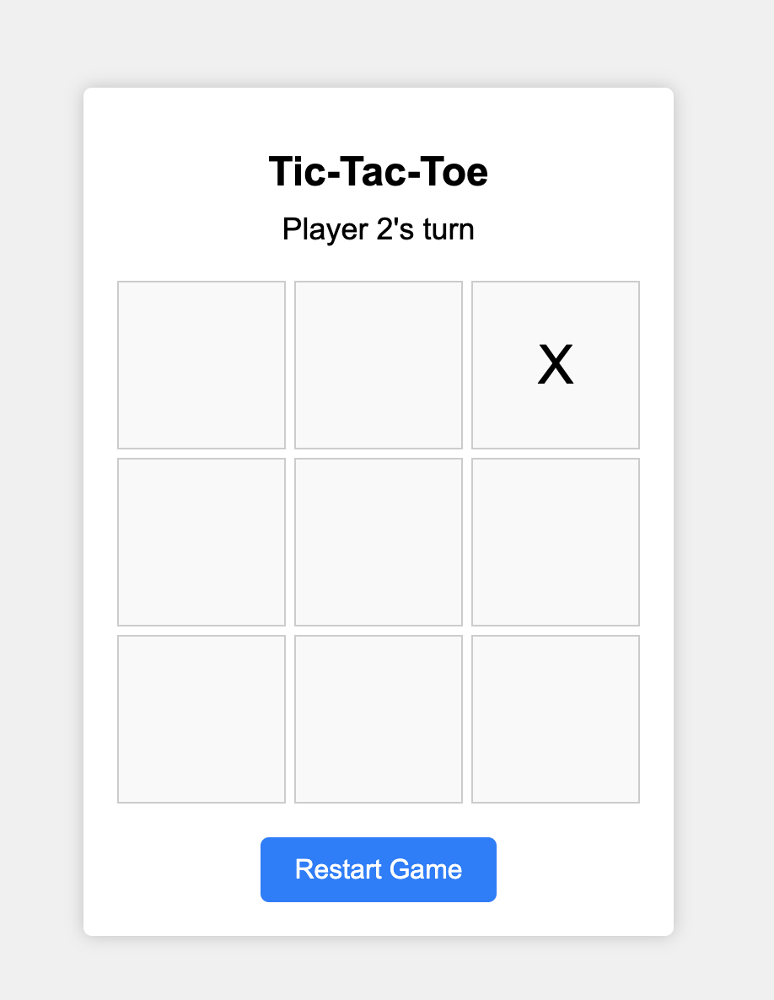

# Odin Tic Tac Toe Project

## Description

The project builds a tic tac toe game to be played by two players. The Players take turns in dropping their token on the board and whoever has three tokens either horizontally, vertically or diagonally wins the game.

## Sample Output of the work

## The Odin Project (Web development) Completed projects
 
* [First Project - Recipes](https://github.com/nd31pr0/odin-recipes) [basic HTML]
* [Second Project - Landing Page](https://github.com/nd31pr0/Landing_Page) [HTML | Basic CSS + flexbox]
* [Third Project](https://github.com/nd31pr0/Etch-a-Sketch) - Rock Paper Scissors [HTML | CSS | Basic JavaScript]
* [Fourth Project - Etch-a-Sketch](https://github.com/nd31pr0/Etch-a-Sketch) [HTML | CSS | Basic JavaScript + events]
* [Fifth Project - Calculator](https://github.com/nd31pr0/Odin_calculator_Project) [HTML | CSS | JavaScript]
* [Sixth Project - Sign-up Form](https://github.com/nd31pr0/odin-signup-form-project) [HTML | CSS |]
* [Seventh Project - Admin Dashboard](https://github.com/nd31pr0/Admin-Dashboard) [HTML | CSS | JavaScript]
* [Eighth Project -Library Project](https://github.com/nd31pr0/Library-Project)[HTML | CSS | JavaScript]
* [Ninth Project - Tic Tac Toe Game](https://github.com/nd31pr0/2-Player-Tic-Tac-Toe)[HTML | CSS | JavaScript]